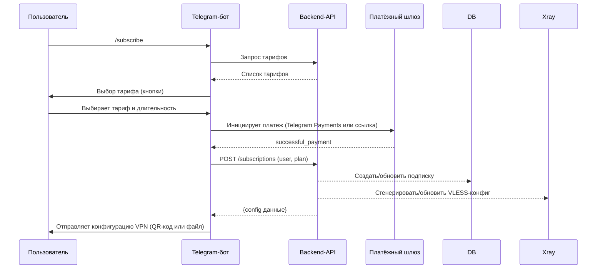
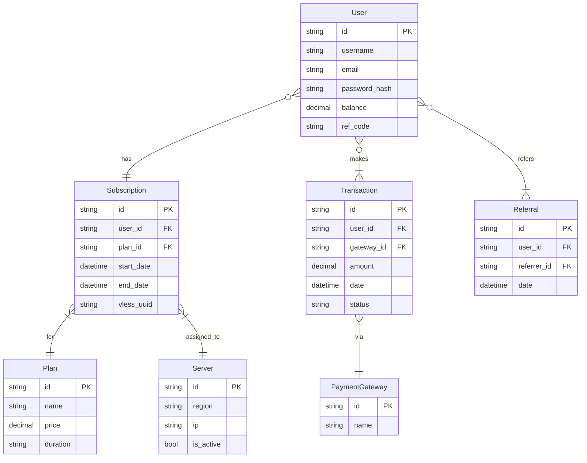
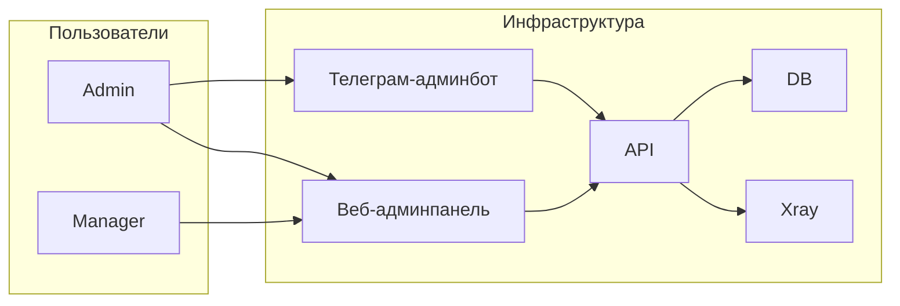

# Спецификация проекта «Умный VPN»  

## Executive Summary  
Проект представляет собой «умный» VPN-сервис с мобильными (Android, iOS) и десктоп-клиентами (Windows, macOS), работающий на основе Xray (VLESS). Ключевые требования: автоматический фейловер (переключение на резервные серверы при падении основного), маскировка трафика под HTTPS, маршрутизация российского трафика через локальный сервер, система WARP и белых списков, а также интеграция с Telegram-ботом и веб-личным кабинетом. Пользовательский интерфейс должен обеспечивать авторизацию, купонную оплату (криптовалютой и рублями) и управление подписками, а админ-панели (веб и Telegram) – контроль сервисов, пользователей и аналитика. В инфраструктуре используются контейнеры и облачные сервисы с CI/CD, мониторингом и безопасностью согласно best practices.  

Приложение ориентировано на рынок РФ (трафик к российским ресурсам идёт через российский сервер) и международный. Серверная часть построена на Xray/VLESS с TLS-обфускацией (модуль XTLS + Fallback) для обхода DPI. Организован failover через DNS/балансировку (или Keepalived). Бэкапы БД/конфигураций выгружаются в Telegram для админов. Система «WARP» (Cloudflare Warp) и белые списки IP/доменов позволяют гибко настраивать доступ. Для платежей интегрированы рублёвые и крипто- шлюзы с рекуррентными платежами и реферальной программой. Администрирование и статистика доступны через защищённые веб- и Telegram-интерфейсы.  

Технологии разделены на MVP- и долгосрочные. Для MVP достаточно готовых решений (например, Flutter/React Native для клиента и простого бот-фреймворка), лёгкого облака (DigitalOcean/Hetzner) и синхронной CI/CD. В расширенной версии – кластеры Kubernetes, geo-distribution по зонам AWS/Azure, высокодоступные БД и отказоустойчивость (multi-AZ, автоскейлинг), продвинутый мониторинг (Prometheus/Grafana) и усиленная безопасность (Vault, DDoS, hardened Linux).  

## Клиентские стеки (Android, iOS, Desktop)  
- **Нативные приложения:** Android – Kotlin/Java с `VpnService`【21†L416-L419】; iOS – Swift/Obj-C с NetworkExtension. **Плюсы:** максимальная производительность, полный доступ к VPN-API (Android VpnService, iOS NEPacketTunnel) и системным фичам (always-on VPN, DPI). **Минусы:** отдельная разработка и поддержка для каждой платформы. Google Play требует декларацию VPN-функций (форму)【20†L37-L44】; Apple требует включения Personal VPN и Network Extension в App Store-этапе (VPN entitlement).  
- **Кроссплатформенные фреймворки:** Flutter, React Native, Kotlin Multiplatform Mobile (KMM). **Flutter (Dart):** один код для Android/iOS, GPU-ускоренный UI, большой экосистемы плагинов. Есть Flutter-плагин, использующий системные API (VpnService/NetworkExtension)【21†L416-L419】. **React Native (JS):** популярный стек, быстрый UI, множество библиотек, но «мост» к нативным модулям для VPN и overhead JS. **KMM (Kotlin):** делит бизнес-логику, UI всё равно нативный. **Плюсы общие:** быстрее выход на обе ОС; **минусы:** возможно больше места в приложении, задержки межъязыковых вызовов, сложнее отладка. Для desktop-клиентов: Electron (JavaScript/HTML) или Tauri (Rust + WebView). **Electron:** кроссплатформенный UI, но очень тяжёлый, большой размер приложения【12†L61-L64】. **Tauri:** лёгкий, использует системный WebView (меньше ресурсов), но молодая экосистема.  

**Таблица сравнения клиентских стеков:**  

| Платформа / Стек      | Язык/Фрэймворк       | Доступ к VPN API       | Плюсы                                    | Минусы                         |
|-----------------------|----------------------|------------------------|------------------------------------------|---------------------------------|
| Android (нативно)     | Kotlin/Java          | Полный (`VpnService`)【21†L416-L419】 | Высокая скорость, полный контроль, стандартная разработка | Два кода (для iOS отдельный)    |
| iOS (нативно)         | Swift/Objective-C    | Полный (NetworkExtension) | Высокая скорость, полная интеграция с iOS | Отдельная разработка, нужный VPN entitlement |
| Flutter              | Dart                 | Через плагин (VpnService/NE)【21†L416-L419】 | Один код для Android/iOS, быстрая разработка UI | Больший размер APK/IPA, плагины |
| React Native         | JavaScript/TypeScript| Через нативный модуль  | Универсальный JS-стек, обширные библиотеки | JS-overhead, сложнее оптимизировать VPN |
| Kotlin Multiplatform | Kotlin               | Нативные зависимости  | Общий бизнес-уровень, единый язык      | UI всё равно рисуется нативно    |
| Electron (Win/Mac)   | JS/HTML/CSS          | Внешний OpenVPN/WG     | Кроссплатформенность, знакомый web-стек【12†L61-L64】 | Очень «тяжёлый», большой App size  |
| Tauri (Win/Mac)      | Rust + WebView       | Внешний OpenVPN/WG     | Лёгкий footprint, безопасен (Rust)      | Меньше шаблонов, моложе экосистема |

## VPN-протоколы и сервер (Xray VLESS)  
- **Xray (VLESS с XTLS):** современный протокол, легковесный и статичный (UUID-аутентификация)【64†L158-L166】. Поддерживает TLS-обфускацию (transport: XTLS), Fallback и мультиплексирование (на одной порту можно «маскировать» несколько сервисов【66†L158-L166】). В режиме Fallback трафик без TLS может перенаправляться и сплититься по разным портам, защищая от активного сканирования. VLESS/Xray **безотказен и производителен**, при этом «прозрачен» для DPI благодаря TLS и технологии Reality (обфускация как HTTPS). Поддерживает «обратный прокси» (возможность балансировки и failover)【66†L158-L166】.  
- **Маскировка трафика:** HTTPS-маскировка достигается настройкой TLS-параметров Xray (специальный сертификат, ALPN «http/1.1») и transport = `xtls-rprx-vision` (встроенная обфускация). Альтернативно, можно использовать внешние прокси (stunnel, nginx) или Cloudflare WARP (WireGuard с 1.1.1.1) для дополнительных слоёв «невидимости». Warped-трафик от Cloudflare может быть частью клиентского стека (для обхода блокировок).  
- **NAT Traversal / Failover:** Xray легко запускается в контейнере и поддерживает TCP/443, UDP. Отказоустойчивость реализуется не на уровне Xray, а через инфраструктуру: DNS Round-Robin, Keepalived/HAProxy или Kubernetes Service. В случае падения сервера автоматический переключатель (например, скрипт мониторинга или запись DNS) отправит новых клиентов на резервный узел. Fallback-опция Xray не заменяет кластеризацию, но обеспечивает использование общего порта для разных сервисов【66†L158-L166】.  
- **Мобильная поддержка:** К Xray/VLESS-клиентам относятся V2RayNG (Android) и Shadowrocket (iOS). Они умеют работать через TLS и JSON-конфиги с Xray. Alt: можно использовать WireGuard как резервную связку (WireGuard быстрее, но не маскирует трафик).  

**Сравнение VPN-протоколов (без ограничений):**  

| Протокол             | Шифрование          | Скорость      | Безопасность      | Особенности                                          |
|----------------------|---------------------|---------------|-------------------|------------------------------------------------------|
| **Xray (VLESS+XTLS)** | ChaCha20-Poly1305, TLS + обфускация | Очень высокая | Очень высокая     | TLS-маскировка как HTTPS, Fallback-фильтрация, статичен (UUID)【64†L158-L166】【66†L158-L166】 |
| OpenVPN              | AES-256 + SSL/TLS   | Средняя       | Высокая           | Проверенный, гибкий (TCP/UDP), но медленнее и заметнее для DPI |
| WireGuard            | ChaCha20-Poly1305   | Очень высокая | Высокая           | Лёгкий, в ядре Linux, быстрое переключение сетей (мобильное) |
| Shadowsocks          | ChaCha20 (AEAD)     | Очень высокая | Средняя           | Прокси без TLS, оптимизирован для скорости, легко блокируется |
| VMess (V2Ray)        | VMess (AES/ChaCha)  | Высокая       | Высокая           | Как VLESS, но stateful; уступает VLESS в скорости |
| Trojan (TLS)         | TLS 1.3 (ChaCha/AES)| Высокая       | Высокая           | Характерный TLS-прокси, для обхода DPI, устаревший по фичам |

## Серверная инфраструктура и оркестрация  
- **Контейнеризация и оркестрация:** Рекомендуется Docker для пакетов Xray и сервисов (API, бота, фронтенда). Для MVP (до 5 серверов) можно обойтись Docker Compose; для масштабирования — Kubernetes (k8s) с Helm-чартами. K8s обеспечивает авто-восстановление, балансировку (Ingress) и горизонтальный autoscale. Для отказоустойчивости можно организовать два кластера в разных дата-центрах.  
- **Облачные провайдеры (таблица):** Основные критерии: покрытие регионов (для гео-маршрутизации), цена, поддержка Network/Load Balancer.  
   
  | Провайдер       | Регионы РФ | Цены (пример 2Core/4GB) | Сеть и безопасность       | Особенности                           |
  |-----------------|------------|-------------------------|---------------------------|---------------------------------------|
  | AWS             | Да (Москва)| ≈ 20–30$/мес            | Высокая, VPC, SG, NACL    | Много сервисов, Auto Scaling, ELB, премиум SLA |
  | GCP             | Да (Moscow)| ≈ 18–25$/мес            | Высокая, VPC, Firewall    | Kubernetes Engine, глобальная сеть    |
  | Azure           | Да         | ≈ 20–30$/мес            | Высокая, NSG, VNet        | Интеграция с MS-сервисами, VPN Gateway |
  | DigitalOcean    | Нет        | ≈ 10–15$/мес            | Стандартный, прост в UI   | Прозрачная тарификация, простота      |
  | Hetzner         | Да (EU)    | ≈ 6–10€/мес (~8–12$)    | Стандартный, cheap        | Очень низкая цена (для РФ нужно VPN)  |

  *Примечание:* для MVP подойдет DigitalOcean/Hetzner из-за простоты и низких цен (до ~$10/сервер). Для растущего сервиса — миграция на гибрид AWS/Azure (мульти-региональные бэзы) для глобального покрытия и масштабирования.  
- **Автоматизация и DevOps:** Использовать Terraform для provision (образы, сети), Ansible/Puppet для конфигурации. CI/CD (GitHub Actions/GitLab CI) с тестами, автопубликация образов, деплой на Kubernetes с помощью ArgoCD или `kubectl apply`.  
- **Масштабирование:** Вертикальный (больше CPU/RAM) для единичных нод и горизонтальный (несколько инстансов). Горизонтальный через DNS/RR, Load Balancer или k8s Service. Кластеры баз данных (PostgreSQL/MySQL) с репликацией.  
- **Мониторинг и логирование:** Prometheus + Grafana для метрик (CPU, память, количество туннелей VPN) и Alertmanager для оповещений. Логирование – централизованный ELK или Fluentd+Loki, хранить логи подключений/ошибок и анализировать их.  
- **High-Availability и гео-дистрибуция:** Активная репликация данных (подписки, балансы) между регионами. Если основная зона падает, DNS-фейловер (например, AWS Route53 health checks) перенаправит трафик на другой регион. Контейнерные кластеры развернуть в нескольких дата-центрах (Moscow, Europe, Asia).  

## Аутентификация и биллинг  
- **Авторизация:** Использовать JWT (JSON Web Tokens) для API (простой и без сессий) или OAuth2 (если планируется интеграция с другими сервисами). Для администраторов – RBAC с ролями (admin, operator). Хранить права в БД. Проверять каждый запрос.  
- **Лицензии/ключи (VLESS):** Каждый пользователь имеет уникальный UUID (идентификатор VLESS). Можно реализовать ротацию ключей: при смене тарифного плана генерируется новый UUID. Запретить шаринг: отслеживать количество одновременных подключений с одного аккаунта; ограничивать или аннулировать при превышении. Хранить в БД связь «пользователь ↔ список активных ключей/сессий».  
- **Платежные шлюзы (таблица):**  

  | Шлюз         | Регион      | API-интеграция        | Комиссия     | Поддержка recurring |
  |--------------|-------------|-----------------------|--------------|---------------------|
  | Stripe       | Global      | REST API, библиотеки  | ~2.9% + $0.30【48†L187-L193】 | Да (Subscriptions)  |
  | PayPal       | Global      | REST API, SDK         | ~2.9% + $0.30【48†L209-L214】 | Да (Subscriptions)  |
  | ЮKassa       | Россия      | API (REST/XML)        | 2.8–3.5%【46†L47-L52】    | Есть (автоплатежи)  |
  | Qiwi Касса   | Россия      | HTTP API, SDK         | ~2.9%【48†L231-L236】    | Есть (абонплата)    |
  | Coinbase/BitPay | Crypto  | API (REST/Webhook)    | Зависит, ~1–4%             | Зависят от провайдера  |
  
  Примечания: Stripe/PayPal для USD/EUR платежей; ЮKassa/Qiwi – для приема рублей (подключаются через банк или агрегатора). Для криптовалют – рекомендуются надежные конвертеры (Coinbase Commerce, BitPay) с автоматическим созданием счетов.  
- **Recurring и подписки:** Поддержать создание подписки (аккаунт+тариф+период). При удачном платеже обновлять срок. Автоматическая оплата (recurring) – если есть кошелёк. При неудаче – уведомлять пользователя и блокировать VPN.  
- **Система лояльности и рефералов:** Начислять бонусы на баланс за покупки/реферальные акции. Хранить реферальный код в БД (связь «приглашённый–пригласитель»). Автоматически выдавать «скидку» или дополнительное время при условии оборота приглашённых.  

## Telegram-бот  
- **Библиотеки:** Python (aiogram, python-telegram-bot) или Node.js (Telegraf). Aiogram обеспечивает удобную работу с callback-кнопками и асинхронность.  
- **Архитектура:** Бот работает через webhook (рекомендуется для быстродействия) или long polling (простой хостинг). Пользователь вводит команду `/subscribe` → бот запрашивает тариф и направляет на оплату (Telegram Payments или внешнюю ссылку). После оплаты бот получает `successful_payment` и вызывает API сервера для активации подписки (и создания/обновления конфигурации VLESS). Бот отправляет конфигурацию VPN-файла или QR-код.  
- **Безопасность:** Хранить токен бота безопасно (Vault или переменные окружения). Использовать HTTPS для webhook. Все внешние команды (подтверждение оплаты) валидировать через Telegram API.  
- **Платежи в боте:** Telegram Payments (Stripe или YooMoney, Qiwi) можно использовать для приема рублей внутри Telegram. Либо бот генерирует счет на сайте и информирует пользователя. Важно обработать вебхуки платежного провайдера и Telegram (`pre_checkout_query`, `successful_payment`).  
- **Системы WARP и белых списков:** Бот может выдавать параметры «WARP» (используя Cloudflare API) или белые списки: например, добавлять IP/домен в whitelist (Trustful List) у VPN-сервера. Если клиент включит режим WARP, весь трафик пойдёт через Cloudflare.  
- **Реферальная система:** При регистрации через бота учитывать параметр реферала, записывать в БД. Бот может показывать баланс бонусов и реферальные ссылки.  

**Diagrams (Mermaid):**  

```mermaid
graph LR
  subgraph Пользовательские клиенты
    M[Мобильный клиент (VPN app)]
    D[Десктоп-клиент]
    W[Веб-браузер]
    T[Telegram-клиент]
  end
  subgraph Серверные сервисы
    API[API-сервер (Backend)]
    Xray[VPN-серверы (Xray VLESS)]
    DB[(База данных)]
    Bot[Telegram-бот]
    WC[Веб-интерфейс (личный кабинет)]
    Pay[Платежный шлюз]
    Admin[Веб-админпанель]
  end
  M --> API
  D --> API
  W --> WC
  WC --> API
  API --> DB
  API --> Xray
  T --> Bot
  Bot --> API
  Bot --> Pay
  Pay --> API
  Admin --> API
```



## Веб-интерфейс и личный кабинет  
- **Стек:** Фронтенд на React или Vue, бэкенд на Node.js (Express/Nest) или Python (Django/Flask/FastAPI). Хранение данных в SQL (PostgreSQL/MySQL) или NoSQL (MongoDB) — в зависимости от нагрузки.  
- **API:** REST API (JSON) для простоты. GraphQL можно рассмотреть при сложных связях (рефералы + баланс), но REST достаточен. Аутентификация – JWT.  
- **UI/UX:** Главная страница с описанием тарифов, кнопкой «Купить» (отображается таблица тарифов с сравнениями). Личный кабинет: баланс, подписки, кнопка «Оплатить/Продлить». Формы пополнения баланса (выбор рубли/крипта), история платежей (таблица с датами/суммами). Таблица тарифов по аналогии с [Стек] – видимое на сайте сравнение параметров.  
- **Хранение конфигураций:** Для каждого активного пользователя хранить конфигурацию VLESS (UUID, TLS-ключи). Конфиги можно генерировать на сервере и либо хранить в БД (или кэше), либо формировать по шаблону на лету. Важна возможность быстрой выгрузки всех данных: скрипт выгружает все пользователи/ключи/настройки и отправляет в Telegram-бот админа (резервная копия).  
- **ER-диаграмма (упрощённо):**  



## Админ-панели (веб и Telegram)  
- **Функции:** Управление пользователями (CRUD), тарифами/планами, серверами Xray (добавить/удалить инстанс), просмотр логов подключений и платежей, аналитика (число активных пользователей, выручка). Возможность принудительно сбросить сессию пользователя (аннулировать ключ). RBAC: роли SuperAdmin/Operator. Обязателен аудит (кто и когда изменил что).  
- **Инструменты:** Для веб: AdminJS (Node) или Django Admin (Python) — быстрые готовые админки с ролями и логами. Forest Admin или Appsmith могут быть подключены к БД для визуализации без кода (но SaaS/онлайн). Для Telegram: отдельный бот или меню в основном боте, который по командам `/stats`, `/ban user`, `/addserver` взаимодействует с API сервера.  
- **Диаграмма общей архитектуры:**  



## Отказоустойчивость, обфускация и маршрутизация  
- **Failover:** Для «умного» VPN настроить мониторинг здоровья (health checks) серверов Xray. При недоступности основного – DNS-фейловер (Route53, или динамический DNS) перенаправит пользователей на резервный. В Kubernetes – использовать Readiness/Liveness probes и ReplicaSets.  
- **Маскировка трафика:** TLS-туннелирование Xray делает трафик неотличимым от обычного HTTPS. Дополнительно можно задействовать Obfuscation (реализация VMess/XTLS Reality) или обход через Cloudflare Tunnel (WARP) и CDN. Например, включение параметра `flow=xtls-rprx-vision` в конфиге Xray и совместная настройка с nginx/haproxy позволяет «упаковать» трафик как HTTP/2【66†L158-L166】.  
- **Белые списки:** На входе (или внутри Xray) можно настроить ACL – разрешать соединения только из доверенных IP/диапазонов (например, корпоративный офис). Это снижает риск злоупотреблений.  
- **Geo-маршрутизация:** Использовать правило вида: если пользователь запрашивает российские ресурсы, то трафик идёт через локальный сервер в РФ (например, по доменному имени или GeoIP). Это ускоряет доступ и соответствует законодательству. В Xray можно прописать роутинг по SNI или HTTP-заголовкам (в параметрах `routing`) для разделения трафика по серверам.  

## Безопасность и соответствие  
- **Шифрование:** TLS 1.3 обязательна (Xray). Сертификаты – доверенные (Let’s Encrypt или коммерческие). Шифровать БД (disk encryption) и резервные копии. Пароли/ключи хранить хэшированными (Argon2).  
- **Хранение секретов:** API-ключи, токены бота – в безопасном хранилище (HashiCorp Vault, AWS Secrets Manager) или хотя бы в переменных окружения контейнеров. Регулярная ротация ключей VLESS при смене паролей.  
- **Защита от утечек:** Отключить DNS/DHCP утечки (настройка VPN-клиента). Использовать Kill-switch на клиенте. Фильтрация IPv6 (запрет его проброса, если не нужен). Проверять конфиги на утечки (инструменты leak test).  
- **GDPR/локальные требования:** Не указано специфических региональных обязательств (клиентский проект). Общие рекомендации: хранить персональные данные (ПД) не дольше чем нужно (в РФ – 6 месяцев), предоставлять пользователю возможность удаления аккаунта. Если есть европейские пользователи – соблюдать GDPR (запрос доступа/удаления данных).  
- **Hardening:** На серверах включить файрвол (ufw/iptables), убрать неиспользуемые сервисы, обновлять ОС. Запретить прямой SSH вход (использовать ключи/2FA). Следовать CIS Benchmarks для Linux.  
- **Incident response:** План действий: мониторить аномалии (внезапно всплески трафика, неожиданные отключения). При инциденте блокировать подозрительных клиентов (админ-команда в Telegram), переключать на резервный сервер. Логи помочь в расследовании.  

## CI/CD, тестирование и деплой  
- **Пайплайны:** GitHub Actions или GitLab CI – автоматическая сборка и проверка кода при коммите. Шаги: `lint`, `unit tests` (Jest/PyTest), сборка Docker-образов, `integration tests` (например, тест API через Postman), деплой на стенд. Для доставки на production – использовать ArgoCD (для k8s) или простой `git push` на master, запускающий rollout.  
- **Helm/Ansible:** Для k8s – писать Helm-чарты, которые устанавливают Xray, API и бота; для простого хоста – Ansible playbooks.  
- **Тестирование:** Юнит-тесты покрытия бизнеса, энд-ту-энд тесты (например, playwright для личного кабинета), нагрузочное тестирование VPN-соединений (iperf3, tsung). Регулярные security-scans (Dependency check, Snyk).  
- **Деплой:** Рекомендуется rolling update (стендбай-поды) или blue/green (разворачивание нового кластера и переключение). Откат через хранение предыдущих образов.  

## Оценка затрат (TCO)  
- **Инфраструктура:** MVP: 2–3 сервера (например, $10–15/мес каждый на DigitalOcean/Hetzner) – обойдутся в ~$30–50/мес. Масштабируемое решение: кластер в облаке (AWS) – несколько сотен долларов в зависимости от нагрузки (каждый EC2 >$30/мес + нагрузка). БД (управляемая PostgreSQL) ≈$30/мес.  
- **Лицензии и ПО:** Открытое ПО (Xray, OS, базы). Опционально платные SaaS (Forest Admin) – десятки долларов в месяц. SSL-сертификаты – бесплатные или ~$50/год за EV.  
- **Платежные комиссии:** ~2–3% от суммы транзакции (Stripe/PayPal: 2.9%+0.30$【48†L187-L193】【48†L209-L214】; ЮKassa/Qiwi: ~3%). На крипту – ~1-4% в зависимости от провайдера.  
- **Операционные расходы:** Разработка и поддержка – главный фактор. DevOps-инструменты (GitLab runner, мониторинг) – от $0 (open source) до $20–30/мес за премиум. Техподдержка 24/7 (если нужна) – от $50/мес.  

*Источники:* Официальная документация Xray/VLESS【64†L158-L166】【66†L158-L166】, Android (VpnService) и Apple (NetworkExtension) docs, сайты облачных провайдеров, платежных шлюзов【48†L187-L193】【46†L47-L52】, а также публикации на Хабре/StackOverflow по VPN и CI/CD практикам. Этот документ структурирован по анализу требований и доступных технологий, чтобы обеспечить полноту проекта.