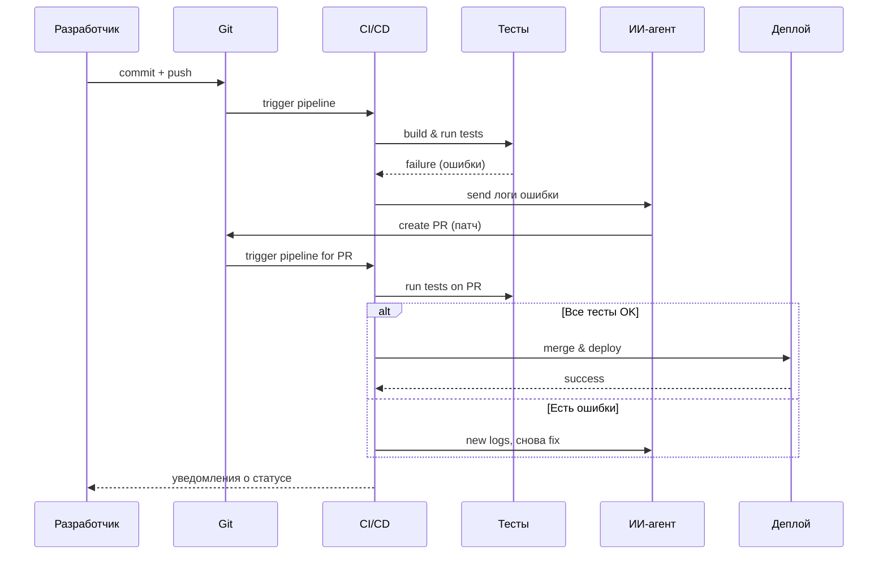

# План реализации AI-ориентированного CI/CD для «умного VPN»

## Executive Summary  
Проект «умный VPN» предусматривает **автоматизацию полного цикла разработки и выпуска**: от коммита кода до его деплоя в боевой среде. Ключевая особенность – **ИИ-агент**, автоматически анализирующий результаты CI-пайплайна, генерирующий исправления и повторно запускающий тесты. Цель – свести к минимуму ручное участие в детекте и фиксе багов, ускорить выпуск новых версий и повысить качество. Успех оценивается метриками конвейера (покрытие тестами, процент успешных сборок, MTTR), а также качеством и надежностью автогенерируемых патчей (доля исправлений, прошедших тесты и деплой без ручного вмешательства).

Архитектура включает репозиторий кода, CI-сервер с изолированными раннерами (Docker, Kubernetes/Firecracker), тестовые окружения, AI-агента с доступом к репозиторию (ограниченные права), и механизмы обратной связи. После каждого коммита пайплайн проходит стадии сборки и тестирования; при сбоях ИИ-агент анализирует логи, предлагает патч (в виде pull request или автоматического коммита), повторно запускает тесты и, при успехе, продвигает изменения дальше.  

**Основные компоненты**: SCM-репозиторий, CI/CD (GitHub Actions/GitLab CI), sandbox-раннеры (Docker, Firecracker, gVisor), тестовые фреймворки (unit/интеграционные/e2e), AI-агент (LLM + среда выполнения), система issue-трекинга (Jira/GitHub Issues), GitOps (ArgoCD/Flux), Helm/Ansible для деплоя. Настроены мониторинг (Prometheus/Grafana) и алерты (Slack/Telegram) для ключевых метрик пайплайна.  

В MVP версии фокус на **предложениях патчей через PR** (human-in-loop), с постепенным переходом к автоматическим коммитам и автослиянию при «зелёном» статусе. Roadmap предусматривает микро-итерации: сначала базовый CI с IT-агентом на уровне линтинга и юнит-тестов, затем расширение на интеграционные тесты и полные деплои. Ниже приведена детальная спецификация по ключевым аспектам.

## Цели и метрики  
- **Автоматизация:** CI-пайплайн автоматически компилирует и тестирует приложение, а ИИ-агент самостоятельно диагностирует и устраняет ошибки без ручного вмешательства (на этапе MVP – с одобрением человека). Это повышает скорость доставки, снижает процент человеческих ошибок и позволяет разработчикам фокусироваться на фичах.  
- **Критерии успеха:** высокий процент успешно пройденных сборок и тестов (Build Success Rate). Для зрелого конвейера ориентир – **<15% проваленных релизов**【70†L139-L146】, быстрый MTTR (цель – <1 часа)【70†L139-L146】. Покрытие кода тестами (code coverage) должно быть максимальным: оно измеряет долю проверяемого кода【73†L13-L20】, и цель – покрыть все критичные пути (например, >80%). Метрика **pass rate** (успешно пройденных тестов) близка к 100%. Ещё важны время «commit→deploy» (<1 дня)【70†L139-L146】 и время «commit→fix» (time-to-fix) – чем короче, тем лучше. Систематически собираем и трендим: Deployment Frequency, MTTR, Lead Time, Change Failure Rate【70†L139-L146】【72†L219-L227】.  

## Архитектура системы  
Система разделена на несколько слоёв:  
- **Репозиторий кода** (GitHub/GitLab): хостинг кода приложения (VPN-клиента/сервера) и CI-скриптов.  
- **CI/CD сервис:** GitHub Actions или GitLab CI (может быть self-hosted), запускающий сборки и тесты на каждое изменение.  
- **Сандбокс-раннеры:** изолированные окружения для выполнения сборок. Это могут быть Docker-контейнеры на VM, Kubernetes Pod или микроВМ Firecracker【68†L137-L146】. Они изолируют ресурсы и защищают хост от несанкционированных изменений (контейнеры легче, Firecracker даёт аппаратную изоляцию【68†L151-L158】).  
- **Тестовые среды:** для интеграционных и e2e-тестов разворачиваются тестовые стенды (контейнеры или виртуальные среды).  
- **ИИ-Агент:** LLM (например, GPT-4) с подключённым Code Execution sandbox. Агент получает результаты CI (логи ошибок, артефакты), предлагает исправления и выполняет их в изолированной среде перед оформлением PR или коммитом. Доступ у агента ограничен (read/access к коду, write-only на отдельной ветке).  
- **Система трекинга:** Jira или GitHub Issues для создания тасков по падениям сборок. AI-агент может автоматически создавать issue с описанием ошибки.  
- **Деплой-система:** Argo CD (GitOps) или Flux для автоматического развёртывания артефактов в Kubernetes по успешному прохождению CI. Либо использовать Ansible/Helm на bare-metal.  
- **Мониторинг и алерты:** Prometheus собирает метрики пайплайна и приложения, Grafana визуализирует; ELK/EFK собирает логи. Оповещения отправляются DevOps/ML-команде по Slack/Telegram при сбоях CI или аномалиях.  

```mermaid
graph TD
  subgraph "Development"
    Dev(Разработчик) -->|git push| Repo(Репозиторий)
  end
  subgraph "CI/CD Pipeline"
    Repo --> CI(CI/CD-сервер)
    CI --> Runner(Изолированный раннер)
    Runner --> Tests(Запуск тестов)
    Tests --> Results{Результаты}
    Results -- Ошибки --> Agent(ИИ-агент)
    Agent --> CI
    Agent -->|PR/commit| Repo
    Results -- OK --> Deploy(Деплой-система)
  end
  subgraph "Production"
    Deploy --> Prod(Рабочая среда)
  end
  Note over Agent, Runner: AI detect & fix cycle
```



## Окружение разработки и раннеры  
- **Контейнеры Docker:** Основной инструмент для изоляции. Каждый шаг CI выполняется в контейнере с чётким ограничением ресурсов (CPU, память). Образы содержат все зависимости: компиляторы, библиотеки, тестовые фреймворки.  
- **Изолированные раннеры:** Для повышенной безопасности (особенно при автогенерации кода) используют **микро-ВМ** (Firecracker) или **gVisor** над контейнерами. Firecracker обеспечивает аппаратную изоляцию на уровне VM【68†L151-L158】, но требует преднастройки (ядро, сеть, сборка образов). gVisor перехватывает syscalls внутри контейнера【68†L139-L146】, проще в интеграции, но чуть медленнее на I/O.  
- **Sandboxing:** Любое исполнение кода, сгенерированного ИИ, происходит в изолированной среде (микро-ВМ), с **таймаутами** и лимитами. Запрещён исходящий трафик (network egress policy), чтобы патчи не скачивали ничего извне.  
- **Ресурсные лимиты:** CPU/Memory на задачу (например, 1 CPU, 2 GB) предотвращают DoS. Таймауты на выполнение (например, 10 мин на тест). Рестрикты Docker seccomp/namespace исключают опасные syscalls.  

**Сравнение технологий изоляции:**  

| Sandbox            | Isolation          | Время старта | Оверхед CPU/RAM  | Интеграция (CI/CD)     |
|--------------------|--------------------|--------------|------------------|------------------------|
| Docker (container) | OS-level           | <1 с         | Низкий (на уровне контейнера) | Прямо с CI, просто настройки.  |
| Firecracker (microVM) | Hardware-level (KVM) | ~125 мс【68†L137-L146】 | ~5 MB RAM + гостевое ядро【68†L137-L146】 | Требует создания VM-образов, сложнее оркестрация. |
| gVisor             | User-space kernel  | <1 мс        | Минимальный (система перехвата) | Работает с Docker/K8s (runtimeClass), некоторые syscalls недоступны【68†L137-L146】. |

## CI/CD и оркестрация  
- **Инструменты:** GitHub Actions или GitLab CI с self-hosted раннерами. Для Kubernetes – Argo CD или Flux (GitOps) для автоматической синхронизации состояний кластера с репозиторием. Деплой инфраструктуры: Terraform, Helm-чарты или Ansible playbooks.  
- **Пайплайн:**  
  1. **Linting/Статика кода:** ESLint/Flake8/GoLint, стилевые проверки. Артефакт: отчет линтера.  
  2. **Unit-тесты:** Запуск фреймворков (pytest, JUnit, Go test) на каждом коммите. Артефакт: результаты и coverage report (отличный показатель покрытия)【73†L13-L20】.  
  3. **Integration-тесты:** Поднятие тестовой среды (контейнеры с базами, сервисами) и выполнение интеграционных сценариев.  
  4. **E2E-тесты:** Имитация работы клиента с реальным бэкендом (например, Selenium/Appium для UI, или Postman для API).  
  5. **Security Scans:** Статический анализ (SAST, Snyk, Semgrep), Dependency scanning (Snyk/OWASP Dependency-Check). DAST (OWASP ZAP сканирует HTTP-эндпоинты).  
  6. **Performance Tests:** Нагрузочные тесты (JMeter/Locust/iperf) на тестовых стендах, для оценки производительности VPN/сервисов.  
  7. **Deploy:** При «зелёном» статусе автоматический деплой на staging (ArgoCD) и затем на production после дополнительной проверки.  
- **Артефакты:** Каждый этап сохраняет отчёты (лог сборки, результаты тестов, покрытие, security scan), передаваемые ИИ-агенту или сохраняемые для аудита. При падении любого шага – возвращаемся к AI-циклу.  

## Тестирование  
- **Unit-тесты:** Проверка функций/методов, покрытие тривиальных логик.  
- **Integration-тесты:** Тестируют взаимодействие компонентов (например, клиент устанавливает VPN-соединение с тестовым сервером).  
- **E2E-тесты:** «Сквозные» сценарии: развернуть приложение полностью и выполнить пользовательские сценарии (авторизация, установление туннеля).  
- **Contract tests:** Если микросервисы, проверка API-контрактов (например, с Pact).  
- **Fuzzing / Property-based tests:** Автоматическая генерация случайных/крайних входных данных для поиска ошибок.  
- **Нагрузочные тесты:** моделирование множества клиентов VPN (iperf, Locust) для оценки стабильности под нагрузкой.  
- **Тесты безопасности:** SAST (Статический анализ кода) – SonarQube/Snyk; DAST (динамический анализ) – OWASP ZAP для веб-интерфейсов; Dependency scanning – уязвимости в библиотеках.  
- **Роль ИИ:** Агент получает результаты (логи упавших тестов, отчёты статиков). Если тесты упали, ИИ анализирует стектрейс, локализует проблему в коде (на основе бага) и генерирует исправление. Затем автоматически запускает всё тестирование заново. Процесс повторяется, пока все критические тесты не проходят или не исчерпан лимит попыток. ИИ также может предлагать недостающие тесты на основе паттернов (например, генерация тест-кейсов).  

## AI-агент  
- **Модель и инструменты:** Используем LLM (GPT-4/GPT-4o/GPT-4o-32k и т.д.) с доступом к приватному окружению code-execution (Docker/Firecracker). Агент имеет read-доступ к репозиторию и write-доступ к временной ветке (например, `ai-fixes/*`). Каждый сеанс ограничен по времени (например, 5 минут) и объему изменений.  
- **Безопасность:** Агент не имеет админских прав в основную ветку до прохождения проверки. Доступ к секретам (API-ключи, пароли) запрещён – они хранятся во Vault и не передаются LLM.  
- **Пайплайн работы агента:**  
  1. **Обнаружение ошибки:** после неудачного теста агент парсит отчёты (stdout, журналы). Формирует проблему (пример: “Unit-тест показал, что метод Foo() возвращает null при некорректном вводе”).  
  2. **Локализация:** ИИ анализирует код (при необходимости встраивает в контекст функцию/модуль) и определяет подозрительное место.  
  3. **Генерация патча:** На основе указанной ошибки ИИ генерирует правки (diff) или новый код. Делает **few-shot** примеры запросов: один или два похожих патча как образец.  
  4. **Проверка патча:** Применяет патч в тестовом раннере, запускает тесты вновь.  
  5. **Валидация:** Если все тесты проходят и не появились новые критические ошибки, патч считается приемлемым. ИИ форматирует отчет (JSON/YAML) с данными: затронутые файлы, изменения, результаты тестов, метрики (например, “до/после” коверидж).  
  6. **Commit/PR или откат:** Если режим – auto-commit, ИИ создаёт Pull Request с описанием изменений и ссылкой на отчёт. При green-light его можно авто-мерджить; при фейле – он может попробовать другой патч или создать задачу для человека.  
- **Пример формата отчёта (JSON):**  
  ```json
  {
    "test_failures": [
      {"test": "testFooFails", "error": "NullPointerException", "location": "Foo.java:123"}
    ],
    "suggested_changes": [
      {"file": "Foo.java", "patch": "@@ -120,7 +120,7 @@\n- if(x == null) return null;\n+ if(x == null) return defaultValue;\n"}
    ],
    "tests_before": {"passed": 42, "failed": 3},
    "tests_after": {"passed": 45, "failed": 0}
  }
  ```
- **Prompt-шаблон (пример):**  
  ```
  [Ошибка] Тест testFoo обнаружил NullPointerException в Foo.java:123.
  [Контекст] Покажи код Foo.java вокруг этой строки...
  [Задача] Сгенерируй исправление: не должен падать на null.
  [Требования] Покрыв код новым или модифицированным тестом для проверки фоллбека.
  ```
  Агент возвращает «[PATCH]» и «[TEST]» части в отчёте.  

## Автоматическое исправление кода  
- **Стратегии релиза исправлений:**  
  - *PR-only:* ИИ создаёт Pull Request, разработчик вручную проверяет и мержит. MVP-стратегия (минимальный риск).  
  - *Auto-commit с ревью:* ИИ коммитит в feature-ветку, после прохождения тестов PR автоматически мержится после 1 люди.  
  - *Auto-merge on green:* Если все CI-тесты на PR проходят, изменения сливаются без участия человека (подход для продвинутой стадии, требует высокой доверия).  
- **Тестирование патчей:** После каждого патча выполняется полный цикл тестов, включая все уровни. Патч считается успешным, если **никакой тест не падает** и не увеличивается процент флейков.  
- **Безопасность патчей:** Прежде чем применять автокоммит, система проверяет отсутствие добавленных секретов и уязвимых зависимостей (SCA). Каждый патч проходит скан Snyk/Sonar. Если найдено новое известное уязвимое использование, патч отклоняется.  
- **Откат:** Если после слияния в прод выявляется нарушение, система автоматически откатывает последнюю стабильную сборку (Blue/Green или last known good). AI-агент помечает «мердж-блок» флагом и прекращает автофиксы до вмешательства человека.  
- **Права:** ИИ-агент ограничен в правах: он не может влиять на ключевые конфигурации или инфраструктуру, лишь на код приложения в контролируемом режиме (feature-ветки).  

## Мониторинг и метрики  
- **Метрики пайплайна:** Успешность сборок (Build Success Rate), доля упавших CI-задач, время от коммита до развертывания (Lead time)【70†L139-L146】. **MTTR:** среднее время восстановления после сбоя (целевое <1 часа)【70†L139-L146】. **Coverage:** процент покрытого кода (критические участки – 100%). **Model Confidence:** доверие LLM (если доступен), флаг выходов AI. **Flaky tests:** процент нестабильных тестов (интересно, чтобы ИИ мог помечать непредсказуемые).  
- **Наблюдаемость:** Prometheus собирает метрики конвейера (Job duration, queue time), Grafana отображает дашборды (показывая тренды Build Success Rate, время деплоя, MTTR). Логи CI/AI сохраняются (ELK) – анализируются по ошибкам и действиям AI.  
- **Алерты:** Настроить уведомления в Slack/Telegram при падении пайплайна (например, правило «сборка упала 3 раза подряд»), когда ИИ не смог найти фикс, или когда среднее время фикса растёт.  

## Управление задачами и трекинг  
- **Issue-трекер:** Интеграция с Jira/GitHub Issues. При каждом сбое CI-шага автоматически создаётся задача с описанием ошибки (ИИ может парсить вывод и формировать шаблон тикета). Задачи получают метки (CI-fail, нужно-фикс).  
- **Приоритетизация:** Баги ранжируются по критичности (продажный баг, security bug, мелкие). Система может перевести особо критичные сразу в «hotfix». AI-агент помечает pull request меткой «AI-fix».  
- **SLA:** Задачи по багам высокого приоритета должны быть либо исправлены ИИ, либо назначены людям в течение заданного времени (например, 1 рабочий день для критичных).  

## Безопасность и соответствие  
- **Ограничение прав ИИ-агента:** Агент имеет read-only доступ к репозиторию и write-access к отдельной ветке. Ни одно действие агента не должно автоматически влиять на production без review. Используем GitHub Apps или робота с минимальными правами.  
- **Review gates:** Требовать обязательное ревью у человека при изменении критичных файлов (конфигурации, скрипты деплоя). Автоматические тесты при этом являются «шлагом безопасности»: без их прохождения не происходит merge.  
- **Секреты и хранилище:** Все секреты (API-ключи, токены) вынесены во Vault (HashiCorp Vault или аналоги)【68†L151-L158】. CI/CD имеет доступ к ним по запросу, а ИИ-агент – нет. Проверяем каждую сборку на отсутствие «leaked secrets».  
- **Аудит:** Вести лог всех действий агента и CI (кто запустил сборку, какие коммиты сделал ИИ, какие тесты упали). Использовать WORM-хранилище для логов.  
- **Сборка/тесты:** Должны быть воспроизводимыми: один и тот же код + те же контейнеры дают одинаковый результат. Это важно при отладке и аудите.  
- **GDPR/локальные:** Не указано – ориентируемся на общие принципы (персональные данные пользователей сохраняются не дольше нужно, предоставляется возможность удаления).  

## Инфраструктура для обучения модели  
- **Сбор данных:** Анонимизированные логи CI (из каких файлов были ошибки, какие патчи предлагались) сохраняются в репозитории знаний. История PR-фиксов сохраняется для обучения (анализ успешных и неуспешных исправлений).  
- **Хранение патчей:** Отдельный реестр исправлений (можно в Git, помечать метками success/fail). Эти данные нужны для непрерывного обучения модели (fine-tuning) и валидации качества.  
- **Метрики качества патчей:** Доля автокоммитов, не требовавших ручной правки; количество ошибок на тысячу строк кода после фиксов; доверие модели в предсказании (опционально).  
- **CI для модели:** Регулярный fine-tune на новых данных (при накоплении критичной массы, например, ежемесячно). Собственная среда (можно использовать GPU в облаке) для обучения/дообучения, с ограничениями на объём и приватностью. Данные тренируются только на не содержащих ПД или секретов логах.  

## CI для нейросети и проверка патчей  
- **Наборы тестов для модели:** Подготовить тестовый репозиторий (testbed) с искусственными багами и ожидаемыми фиксов. Периодически проводить A/B тесты: снапшот модели A (текущая) vs B (обученная) на этих тестах, сравнивать качество патчей.  
- **Canary-патчи:** Для выкатки автофиксов в продакшн использовать canary: часть коммитов (например, каждый n-ый) сначала применяются только в staging. Логи и результаты анализируем, прежде чем разрешить автослияние полностью.  
- **Метрики модели:** Accuracy (процент верных фиксов на тестах), False Positives (патч не решал проблему), False Negatives (модель не отреагировала на проблему), средняя уверенность (confidence score) – отслеживаются отдельно.  

## Риски и меры их снижения  
- **Неправильные патчи:** Модель может «надумывать» решения (hallucination). Решение: обязательное прогон полных тестов, проверка SAST. PR-only режим снижает риск попадания деструктивных изменений.  
- **Безопасность кода:** Автокоммит мог бы внедрить уязвимости. Решения: статический анализ, рецензирование патчей, ограничения прав. Запрет на внесение новых зависимостей без одобрения.  
- **Разбег (drift):** Наличие ИИ, сам вносящий изменения, может усложнить трассируемость. Вводим полную историю изменений: лог патчей и версионирование артефактов.  
- **Runaway commits:** Ограничиваем число авто-коммитов подряд (например, не более 3 неудачных попыток) и даём право людям перекрыть цикл.  
- **Нагрузка на CI:** Постоянная генерация патчей может перегрузить CI. Решение: rate-limiting (сколько одновременно PR от ИИ допускается) и мониторинг загрузки.  

## Пошаговый план реализации  
**Вводные предположения:** Команда из 4–6 человек (разработчики, DevOps, ML-инженер, SRE). Код проекта написан на одном языке (например, Python или Go). Без специализированных легаси-зависимостей. ИИ-агент изначально имеет ограниченные права (просто открывает PR).  

1. **Подготовительный этап (1–2 нед.):** Настроить базовый CI/CD (GitHub Actions) с этапами `lint` и `unit-tests`. Развернуть образ тестовой среды. Установить мониторинг (Prometheus) на метрики CI.  
2. **Настройка тестового стенда (1–2 нед.):** Добавить интеграционные тесты (например, эмулятор VPN-сервера и проверки соединения). Убедиться, что pipeline корректно проходит все тесты при нормальном коде и падает на искусственных ошибках.  
3. **ИИ-агент (MVP, 2–3 нед.):** Интеграция LLM через API или свой сервер. Реализовать механизм создания PR-фиксов: при падении тестов CI вызывает скрипт, который отправляет данные ошибочного теста в LLM, получает патч и создает PR. (Примерный псевдокод: [LLM.call(input) → diff]). Тестирование этого шага вручную.  
4. **Анализ патчей (1–2 нед.):** Автоматизировать прогон тестов на PR из ИИ. Если все тесты проходят – notify. Если нет – откат. Настроить роль ревьюера (человек) для первой версии.  
5. **Улучшение пайплайна (2–3 нед.):** Добавить security-scans (Snyk), performance-тесты в pipeline. Добавить автоматическое создание задач в трекере (GitHub Issues) при сбоях. Настроить уведомления и dashboard (Grafana).  
6. **Развёртывание (2 нед.):** Настроить ArgoCD для автоматического деплоя прошедших проверку образов в staging/prod. Добавить "smoke"-тесты после деплоя (короткие проверки работоспособности).  
7. **Расширение функционала (4–6 нед.):** Внедрить авто-мердж (закрытие PR без ревью при зелёном статусе) для безусловно простых изменений. Реализовать canary-деплой исправлений (активное тестирование на подвыборке). Начать сбор данных для ML (логирование ошибок и патчей).  
8. **Final Phase:** Автоматизировать fine-tuning модели на накопленных данных, провести A/B тестирование обновлённой модели. Переход на full auto-merge и масштабирование.  

**Примерная разбивка по ролям:**  
- Dev: пишут тесты и код, ревью PR.  
- DevOps/SRE: настраивают CI/CD, Kubernetes, мониторинг.  
- ML Engineer: интегрирует и обучает LLM-агента, пишет prompt-шаблоны.  
- Security: контролирует SAST/DAST интеграцию, ревьюит патчи.  
- Product Owner: ставит приоритеты багов, решает о переходе на автофиксы.  

## Примеры prompt-шаблонов и форматов отчётов  
- **Пример промта (сокращённо):**  
  ```
  [Ошибка теста] Тест testUserLogin упал: AssertionError в Authentication.java:45 (ожидалось True, получили False).
  [Контекст] Вот фрагмент кода (Authentication.java): ... 
  [Задача] Найди и исправь причину AssertionError, обеспечь прохождение теста.
  ```
- **Пример JSON-отчёта (от ИИ-агента):**  
  ```json
  {
    "error": {
      "test": "testUserLogin",
      "message": "AssertionError",
      "location": "Authentication.java:45"
    },
    "patch": {
      "file": "Authentication.java",
      "diff": "@@ -44,7 +44,7 @@\n-    if (!user.isValid()) return false;\n+    if (!user.isValid()) { this.logger.warn(\"Invalid user\"); return false; }\n"
    },
    "test_results": {
      "before": {"passed": 10, "failed": 1},
      "after": {"passed": 11, "failed": 0}
    }
  }
  ```
- **Таблица сравнения стратегий автофикса:**  

  | Стратегия          | Безопасность    | Скорость фикса  | Зависимость от людей |
  |--------------------|-----------------|-----------------|----------------------|
  | PR-only            | Высокая (люди)  | Низкая          | Требует ревью        |
  | Auto-commit        | Средняя (тесты) | Средняя         | Плюс CI-комьюнити    |
  | Auto-merge on green| Средняя         | Высокая         | Нет (после trust build) |

- **Рекомендуемые инструменты:**  
  - CI: GitHub Actions, GitLab CI, Jenkins.  
  - DevOps: Kubernetes, ArgoCD, Terraform, Helm, Docker.  
  - Тесты: pytest/JUnit, Postman, Locust, Selenium, OWASP ZAP.  
  - Мониторинг: Prometheus, Grafana, ELK (Elasticsearch/Logstash/Kibana).  
  - Security: SonarQube, Snyk, Dependency-Check.  
  - Секреты: HashiCorp Vault, AWS Secrets Manager.  
  - Issue-tracking: Jira, GitHub Issues, Slack/Telegram для уведомлений.

**Источники:** официальная документация GitHub Actions, Argo CD, Kubernetes; статьи Splunk【70†L139-L146】 и TestRail【72†L219-L227】【73†L13-L20】 о метриках CI; документация Firecracker/gVisor【68†L137-L146】 о sandbox. В тексте приведены ключевые ссылки на источники (см. формат 【cursor†L-L】).